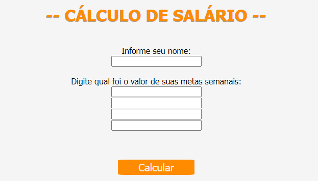
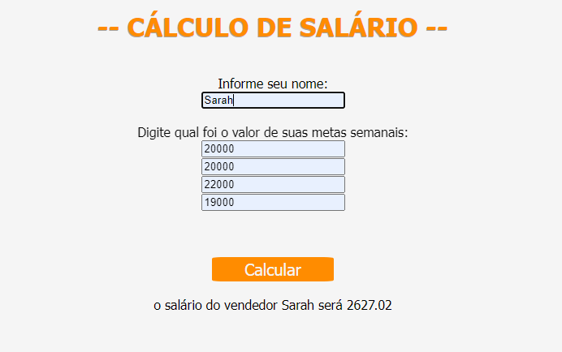

# INDÍCE
[Projeto de Sistema para Calcular Salário - Introdução](#projeto-de-sistema-para-calcular-sal%C3%A1rio---introdu%C3%A7%C3%A3o) 
[Funcionalidades](#funcionalidades)  
[Tecnologias utilizadas](#tecnologias-utilizadas)  
[Fontes consultadas](#fontes-consultadas)  
[Autores](#autores)  

# Projeto de Sistema para Calcular Salário - Introdução

O PHP é uma linguagem de progamação utilizada para construi sites dinâmicos e para agilizar no desenvolvimento de um sistema, essa linguagem é conhecida por sua facilidade no aprendizado, além se der compatível com muitos sistemas operacionais, tornando seu custo menor. Durante as aulas de progamação aprendemos como utilizar alguns recursos dessa linguagem (cálculo de porcentagem, array, foreach,) que foram utilizados no código abaixo. A seguir você poderá conferir uma explicação bem simplificada de como cada recurso trabalha para fazer o código funcionar.

**Contexto:**
O sistema de uma empresa foi atualizado visando evitar a perda de funcionários, esse novo sistema trabaha utlizando de metas para seus vendedores que recebem um bônus extra no seu salário. As metas são dads por semanas, cada vendedor tem uma meta de R$20.000 para alcançar, somando R$80.000 ao final do mês. Caso o vendedor consiga alcançar esse valor, ele receberá uma bonificação de 1% do valor, caso ele alcançar um valor maior que o esperado, receberá uma bonificação de %5 do valor, se ao final do mês o vaor ultrapassar de R$80.000, ele recebe uma bonificação de 10% (caso o vendedor não bata as metas esperadas, não terá o bônus). Precisaríamos criar um código que solicitasse o nome do vendedo, os valores de meta semanal para assim o sistema calcular o salaário final ao usuário.

## Funcionalidades

### CÁLCULO DE PORCENTAGEM

### ARRAY

### FOREACH

## FONTES CONSULTADAS
[Informações sobre o salário mínimo:](https://www.aen.pr.gov.br/Noticia/Maior-do-Brasil-governador-confirma-novo-Piso-Regional-que-vai-de-R-18-mil-R-21-mil#)

[O que é PHP e Para O que Serve?](https://www.hostinger.com.br/tutoriais/o-que-e-php-guia-basico#)

## Tecnologias utilizadas
Neste projetos tivemos o uso de:
* HTML 5 
* CSS 3
* PHP
* XAMPP
* GIT 
* GITHUB

## Autores

Sarah Ozeto, com a orientação do professor Leonardo Rocha.
